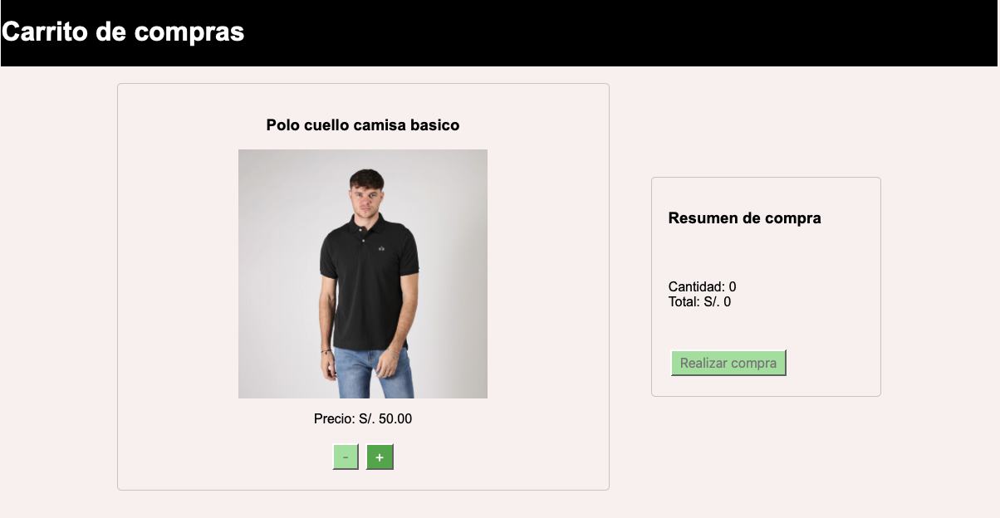
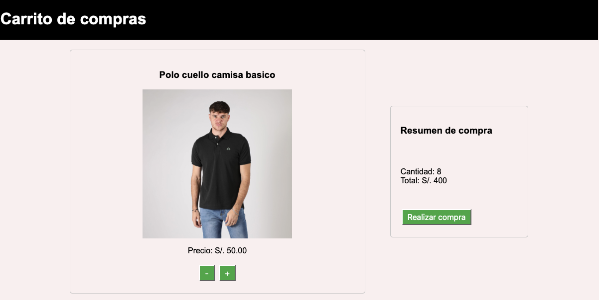
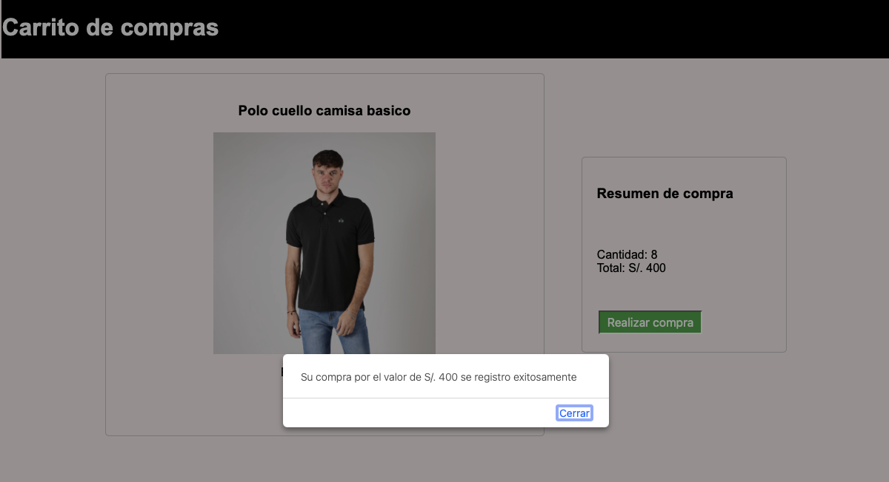

# Simulacion de carrito de compras

El presente proyecto simula un carrito de compras. Contiene un solo producto el cual puedes aumentar o disminuir la cantidad a comprar.

Mediante el uso del metodo getElementbyId() obtenemos los siguientes elementos del DOM:
- Botones de aumentar y disminuir la cantidad a comprar.
- Botón de Realizar la compra.
- Campo de cantidad a comprar.
- Campo de total a pagar.

La funcion `showdetails()` se encarga de mostrar el resumen de la compra (cantidad y total a pagar). Esto se hace por medio de la propiedad innerHTML.

Al cargar la pagina, el boton de disminuir la cantidad a comprar y el boton de realizar compra se encuentran deshabilitados. Una vez que detecte que la cantidad es igual a 1 o mas los botones se habilitan. De igual manera, si se disminuye la cantidad a 0, los botones vuelven a deshabiltarse. Al presionar el boton de realizar compra, se muestra un mensaje de confirmación de compra y se resetean los estados de los campos.
Esta lógica la hacemos mediante el uso de la funcion `stateButtons()` la cual evaluará cada interaccion del usuario y agregara o eliminara la clase ìs-disabled` de los elementos descritos anteriormente.

## Capturas de pantalla

Pantalla de inicio al cargar la página, botones disminuir cantidad y realizar compra deshabilitados.

Botones habilitados al detectar que la cantidad de productos es mayor a 0.

Mensaje de confirmación de compra.

